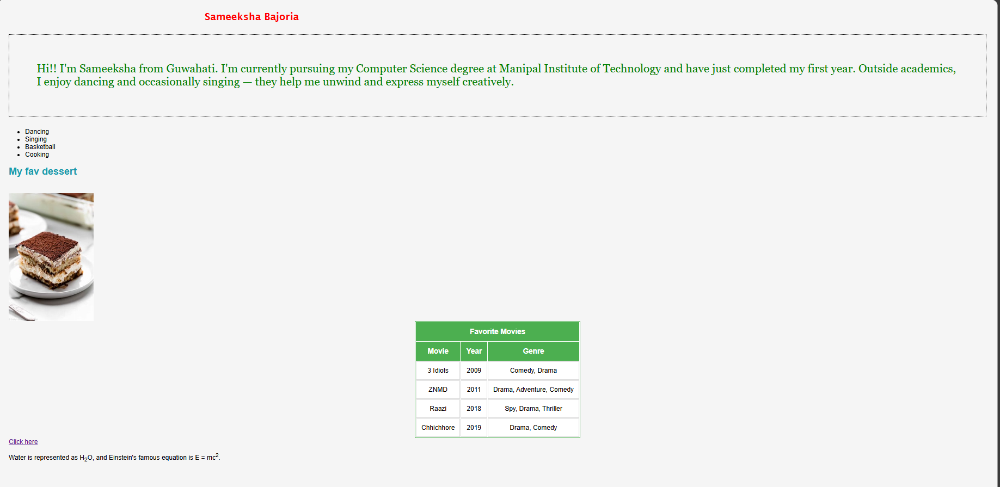

# Requirements
To the existing html file that we created in task1 we were supposed to apply and try different styles.Here i have made a separate file for html and css.
# CODE(.html)
```
<!---Create a new HTML file and style it. Try to:
- Change background color and font styles
- Style headings and paragraphs
- Add padding, margins, and borders
- Center content and try different font sizes and colors--->
<html>
    <head>
        <link rel="stylesheet" href="style.css">
        <body>
            
            <h2 id="p1">Sameeksha Bajoria</h2>
        <p id="p2">Hi!! I'm Sameeksha from Guwahati. I'm currently pursuing my Computer Science
             degree at Manipal Institute of Technology and have just completed my first 
             year. Outside academics, I enjoy dancing and occasionally singing — they 
             help me unwind and express myself creatively.</p>
             <ul>
                <li>Dancing</li>
                <li>Singing</li>
                <li>Basketball</li>
                <li>Cooking</li>
             </ul>
        <h2 id="p6">My fav dessert</h2>
        <br>
        
        <table border="1" cellpadding="10">
    <tr>
        <th colspan="3">Favorite Movies</th>
    </tr>
    <tr>
        <th>Movie</th>
        <th>Year</th>
        <th>Genre</th>
    </tr>
    <tr>
        <td>3 Idiots</td>
        <td>2009</td>
        <td>Comedy, Drama</td>
    </tr>
    <tr>
        <td>ZNMD</td>
        <td>2011</td>
        <td>Drama, Adventure, Comedy</td>
    </tr>
    <tr>
        <td>Raazi</td>
        <td>2018</td>
        <td>Spy, Drama, Thriller</td>
    </tr>
    <tr>
        <td>Chhichhore</td>
        <td>2019</td>
        <td>Drama, Comedy</td>
    </tr>
</table> 
        <a href="https://www.wikipedia.org" >Click here</a>
<p>Water is represented as H<sub>2</sub>O, and Einstein's famous equation is E = mc<sup>2</sup>.
</p>
        </body>
    </head>
</html>
```
# Code(.css)
```
body{
    background-color:rgb(250, 213, 219);
}
#p1{
    color:red;
    font-family:'Lucida Sans';
    font-size:1.5em;
    margin-left:480px;
    
}
#p2{
    border:2px dotted black;
    color:green;
    font-family:Georgia,arial;
    font-size:28px;
    padding:67px;
}
#p89{
    margin:auto;
}

#p6
{color:rgb(25, 154, 173)}
table{
    border:2px solid black;
}
#img1
{
    margin-left:120px;
}
/* style.css */
body {
    font-family: Arial, sans-serif;
    background-color: #f5f5f5;
    padding: 20px;
}

table {
    margin: auto;
    background-color: white;
    border: 2px solid #4CAF50;  
}

th {
    background-color: #4CAF50;
    color: white;
    padding: 12px;
    font-size: 18px;
    text-align: center;
    border: 1px solid #4CAF50;  /
}

td {
    padding: 12px;
    text-align: center;
    border: 1px solid #ddd;  
}

```
# OUTPUT

