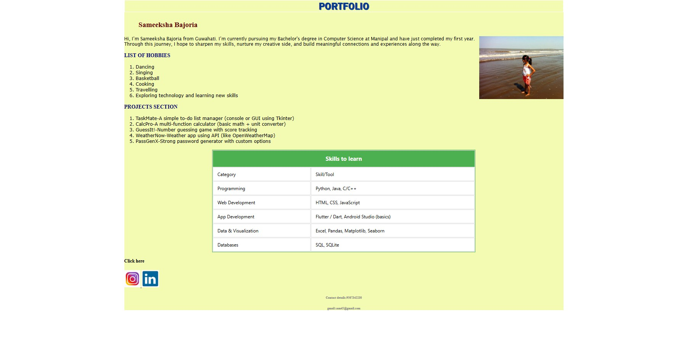

# Requirement
To create a portfolio.Here again ihave created an extrenal css file.
# CODE(.html)
```
 <!---Combined Task – Mini Portfolio Page:
Use both HTML and CSS to create a simple personal portfolio that includes:
- Your name and a short intro
- A profile image
- section with hobbies or interests
- “Projects” section (can just be placeholder titles)
- table of skills or tools you want to learn
- Clean, personalized CSS styling to make it visually appealing--->

<html>
    <head>
        <link rel="stylesheet" href="st.css">
        </head>
        <div id="oo">
            <h2 id="p1">PORTFOLIO</h2>
            <h3 id="p2">Sameeksha Bajoria</h3>
            
            <p id="p3">Hi, I’m Sameeksha Bajoria from Guwahati. I’m currently pursuing my Bachelor's
                 degree in Computer Science at Manipal and have just completed my first year.
                   Through this journey, I hope to sharpen my skills,
                    nurture my creative side, and build meaningful connections and 
                    experiences along the way.</p>
                    <h3>LIST OF HOBBIES</h3>
                <ol id="p4">
                <li>Dancing</li>
                <li>Singing</li>
                <li>Basketball</li>
                <li>Cooking</li>
                <li>Travelling</li>
                <li>Exploring technology and learning new skills</li>
             </ol>
             <h3>PROJECTS SECTION</h3>
             <ol id="p5">
                <li>TaskMate-A simple to-do list manager (console or GUI using Tkinter)

<li>CalcPro-A multi-function calculator (basic math + unit converter)</li>

<li>GuessIt!-Number guessing game with score tracking</li>

<li>WeatherNow-Weather app using API (like OpenWeatherMap)</li>

<li>PassGenX-Strong password generator with custom options</li>
             </ol>
    <table id="tb1">
        <tr>
<th colspan="2">Skills to learn</th>
        </tr>
        <tr>
            <td>Category</td>
            <td>Skill/Tool</td>
        </tr>
        <tr>
            <td>
                Programming	</td>
                <td>Python, Java, C/C++</td>
                </tr>
        <tr>
            <td>
Web Development
            </td>
            <td>HTML, CSS, JavaScript</td>
        </tr>
        <tr>
            <td>App Development</td>
            <td>Flutter / Dart, Android Studio (basics)</td>
        </tr>
        <tr>
            <td>Data & Visualization</td>
            <td>Excel, Pandas, Matplotlib, Seaborn</td>
        </tr>
        <tr>
            <td>Databases</td>
            <td>SQL, SQLite</td>
        </tr>
    </table>
    <h4>Click here</h4>
    <a href="https://www.instagram.com/sameeksha_.16"   href="https://www.linkedin.com/in/sameeksha-bajoria-48a94234a">
    
  
    
</a>
    <h6>Contact details:9567342230</h6>
    <h6>gmail:sam45@gmail.com</h6>


</div>
    
</html>
```
# Code(.css)
```
#oo
{margin-left:450px;
    margin-right:450px;
background-color:rgb(243, 250, 177);
}
#p1
{border:2px solid white;
    text-align:center;
color:rgb(8, 61, 147);
text-shadow:1.9px 1.9px 1px;
font-size:2.2em;
font-family:'Franklin Gothic Medium', 'Arial Narrow', Arial, sans-serif}
#p2
{color:rgb(99, 3, 3);
font-size:25px;
margin-left:50px;}
#p3
{color:rgb(3, 3, 4);
font-family:'Lucida Sans', 'Lucida Sans Regular', 'Lucida Grande', 'Lucida Sans Unicode', Geneva, Verdana, sans-serif;}
#p4
{font-family:Verdana, Geneva, Tahoma, sans-serif;
    color:rgb(4, 4, 4)
}
#img1
{float:right;
size:45px;}
#p5
{font-family:Verdana, Geneva, Tahoma, sans-serif;
color:rgb(5, 5, 5);}
#tb1 {
    width: 60%;               
    margin: 20px auto;        
    border: 2px solid #4CAF50; 
    background-color: #fff;
    font-family: 'Segoe UI', Tahoma, Geneva, Verdana, sans-serif;
}

#tb1 th {
    background-color: #4CAF50;  
    color: white;
    padding: 14px;
    font-size: 20px;
    text-align: center;
    border: 1px solid #4CAF50;
}

#tb1 td {
    padding: 12px 15px;
    border: 1px solid #ddd;
    text-align: left;
    font-size: 16px;
}  
h3
{
color:rgb(12, 12, 119);
}
h6{
    color:grey;
    text-align:center;
}
#op
{
    position:center;}
```
# OUTPUT

