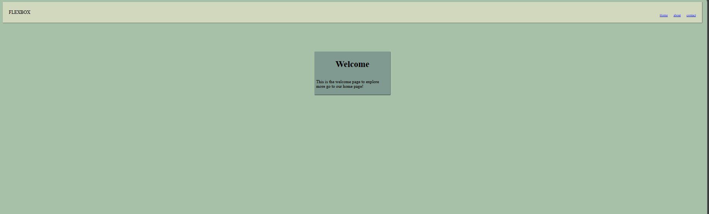

## Code
```
<!DOCTYPE html>
<html lang="en">
<head>
    <meta charset="UTF-8">
    <meta name="viewport" content="width=device-width, initial-scale=1.0">
    <title>FLEXBOX BASICS</title>
    <link rel="stylesheet" href="flexstyle.css">
</head>
<body>
    

    <div class="container">
        <div>FLEXBOX</div>
        <div class="card">
            
        <a href="home.html">Home</a>
                <a href="about.html">about</a>

                        <a href="contact.html">contact</a>

        </div>
    </div>
        <div class="box">

        <h1>
            Welcome
        </h1>
        <p id="ty">This is the welcome page to explore more go to our home page!</p>
    </div>
</body>
</html>
```
## css file
```
.container{
    display:flex;
    align-items: center;
    box-shadow:1px 1px 3px;
    height:60px;
    font-size:2em;
        background-color: #D1D8BE;

    margin:30px;
    padding:42px;
    justify-content:space-between;
    
}
.card{
    display:flex;
    align-self:flex-end;
    font-size:0.7em;
    gap:40px;
}
.box{
    margin:auto;
    display:flex;
    flex-direction: column;
    align-items: center;
    box-shadow:1px 2px 3px;
    width:500px;
    background-color:#819A91;
    padding:12px;
    margin-top:200px;
    justify-content: center;
    font-size: 30px;

}
body{background-color: #A7C1A8;
}
```

