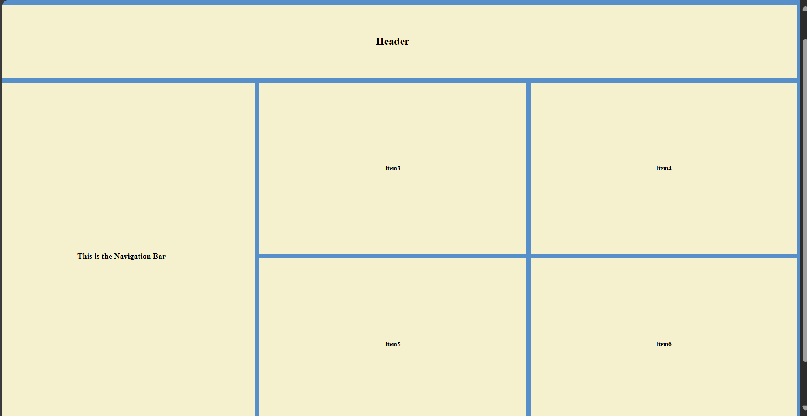

## CODE 
```
<!DOCTYPE html>
<html lang="en">
<head>
    <meta charset="UTF-8">
    <meta name="viewport" content="width=device-width, initial-scale=1.0">
    <title>CSS GRID</title>
    <link rel="stylesheet" href="gridstyle.css">
</head>
<body>
    <div class="container">
        <div class="item item1">
            <h1>Header</h1>
        </div>
        <div class="item item2">
            <h2>This is the Navigation Bar</h2>
        </div>
        <div class="item item3">
            <h3>Item3</h3>
        </div>
        <div class="item item4">
            <h3>Item4</h3>
        </div>
        <div class="item item5">
            <h3>Item5</h3>
        </div>
        <div class="item item6">
           <h3> Item6</h3>
        </div>
    </div>
</body>
</html>
```
### CSS file
```
.container{
    background-color: #578FCA;
    width:100vw;
    height:100vh;
    display:grid;
    row-gap:26px;
    column-gap:30px;
    grid-template-columns: repeat(3,1fr);

    grid-template-rows: 0.3fr 0.7fr 0.7fr;

    margin:0px;
    padding:202px;
    align-items:center;
    justify-items:center;
}
.item1{
    grid-column-start: 1;
    grid-column-end:4;
}
.item2{
    grid-row-start:2;
    grid-row-end:4;
}
.item{
    display:grid;
    justify-content:center;
    width:100%;
    font-size:2em;
    height:100%;
    background-color:#F5F0CD;
    align-items:center;
    margin:auto;
}
```

